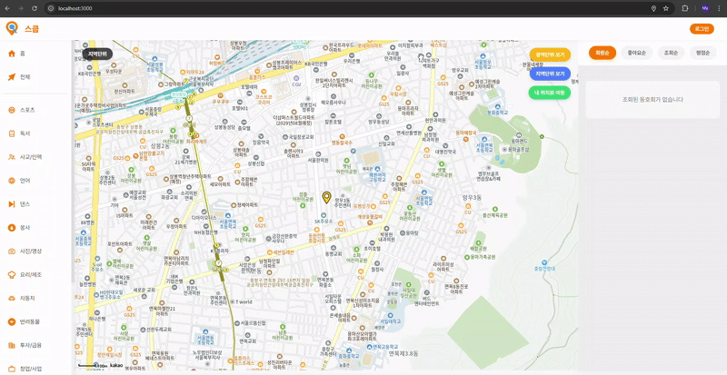
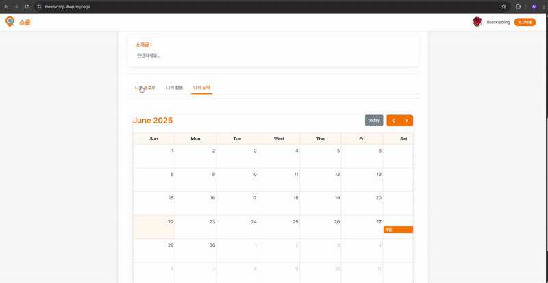
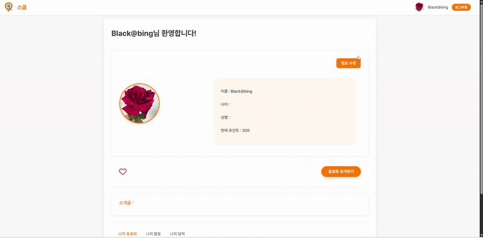

# meetscoop

<h2><a href="https://meetscoop.shop">Meetscoop 이동 링크</a></h2>

## 목차
- [배포 사이트](#배포-사이트)
- [프로젝트 소개](#프로젝트-소개)
- [팀원 소개](#팀원-소개)
- [화면 구성](#화면-구성)
- [주요 기능](#주요-기능)
- [개발 기간](#개발-기간)
- [기술 스택](#기술-스택)
- [협업 도구](#협업-도구-communication)
- [회고 로그](#회고-로그)

## 프로젝트 소개
meetscoop는 도호회 회원들의 적극적인 참여를 통해 협력과 성장을 도모하는 것을 목표로 합니다. 성공적인 동호회 프로젝트 사례를 참고하여 기대 요과와 구체적인 결과물을 제시합니다.

---

## 팀원 소개 

 
<a href="https://github.com/Mr-Binod">팀원 : 비노드 </a> 
역활 : 로그인 페이지, 마이 페이지

 

 
<a href="https://github.com/susuholee">팀원 : 이수호 </a> 
역활 : 메인 페이지

 

 
<a href="https://github.com/zzeen">팀원 : 김지은 </a> 
역활 : 도호회 페이지, 추가 페이지, 상세 페이지

## 화면 구성 :
<label>카카오 로그인</label>
  
<label>개인 정보 수정</label>
  
<label>마이 페이지 기능</label>

## 주요 기능: 

### 담당 : 로그인 페이지
- 카카오 인증 사용해서 로그인 페이지 구현
- 로그인할때 카카오 로그인 화면을 보이고 아이디와 비밀번호를 작성후 카카오에서 인증 받고 쿠키저장하여 로그인 완료 기능
- 해더바에 로그인 버턴 생기고 로그인 완료후 회원 사진, 닉네임랑 로그아웃버턴 생김

### 담당 : 마이 페이지
- 회원 정보 확인 및 수정 기능
- 포인트 350 가진 회원들이 동호회 추가하기 버턴 생기고 동오회 추가할수있는 기능
- 본인이 생성한 동호회 페이지를 확인
- 본인이 좋아요나 댓글 다르는 돟호회 페이지를 확인 그리고 사진 누루면 상세 페이지 이동
- 나의 달력에서 참여 이벤트 날짜랑 내용을 확인 가능 

## 개발 기간
- 2025-05-16 ~ 2025-06-1 (16일)

## API 문서 

## GET Requests

| Method | Endpoint                      | Description                                        |
|--------|-------------------------------|--------------------------------------------------|
| **GET**  | `/login`                      | Display login page                                |
| **GET**  | `/kakao/login`                | Show Kakao login screen                           |
| **GET**  | `/auth/kakao/callback`        | Handle Kakao OAuth callback, create cookie, complete login |
| **GET**  | `/mypage`                    | Navigate to user’s My Page                        |
| **GET**  | `/logout`                    | Show logout page                                  |
| **GET**  | `/auth/kakao/logout/callback`| Delete cookies and redirect to logout main page  |
| **GET**  | `/Edituser`                  | User information edit page                        |
| **GET**  | `/checkcookie`               | Check user cookie                                 |

## POST Requests

| Method | Endpoint                      | Description                                        |
|--------|-------------------------------|--------------------------------------------------|
| **POST** | `/Edituser`                  | Submit user information updates               

## 기술 스택 

### FRONTEND

### BACKEND

## API

## collaboration

# 회고 로그

## 구현
- 카카로 oauth2 로그인 기능, 로그인하면 데이터베이스에 사용자 정보 저장되어 쿠키 생성
- 마이 페이지에서 사용자의 정보 수정 및 관리 가능, 사용자가 생성한 동호회, 활동 내역이랑 동호회 참여 목록 캘린들 통해 확인 가능
- 해더바 로그인과 로그아웃 기능 및 화면 구성 
- 데이터베이스 및 테이블 관계성 설계

## 문제점 및 해결
- 테이블 관계성을 설계하기 위해 여러번 시도 했고 확인한후 설계 했습니다
- 테이블 관계성 설계되어있기 때문에 데이터 추가 및 수정할때 관계성때문에 어려움이 겪였습니다.
- 티원과 같이 일을해야되기때문에 팀원이 데이트가 저장할때까지 데이터가 없어서 기다려야 했어요
- 중간에 팀원 한 명이 이탈하면서 부담이 컸지만, 나머지 팀원들이 더 노력하여 프로젝트를 잘 마무리할 수 있었습니다

## 계획
- 구굴 로그인과 회원 가입 추가 할 예정
- 화면 디자인 좀더 user friendly 만들면서 유저 유입 시킬 예정
- 유저의 좋아하는 캐태고리 받아서 맞는 캐태고리의 동호회 추천